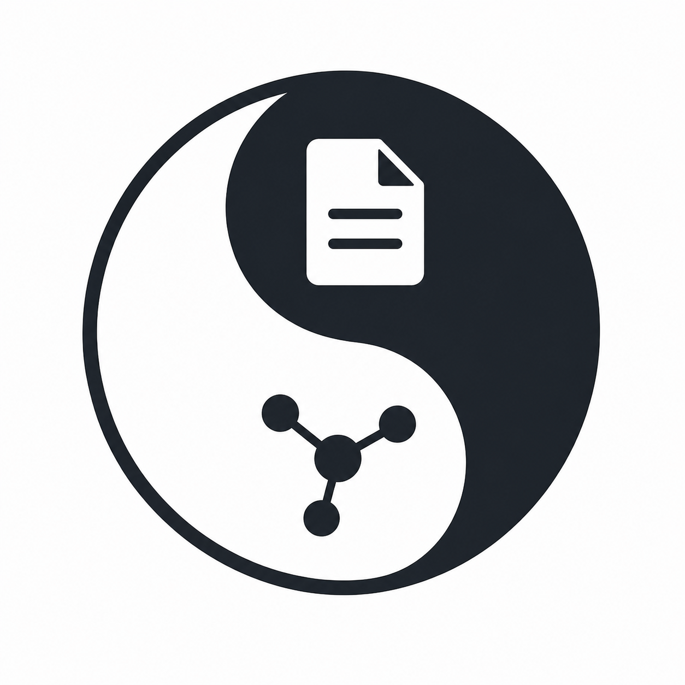

#   Knowledge Index (`ki`)
> Search index for agent memory — knowledge graph index for your documents
<br clear="left">

One searchable graph index across all your documents — point `ki` at a folder (or many) and query the result from the CLI or any AI agent. Multiple folders and users can share the same index. Source files are never modified, so it's safe on an Obsidian vault, a git repo, or a research folder. Backed by Neo4j.


install `ki`, wire into Claude Code, ask Claude what's in your notes:

```bash
uv tool install knowledge-index
ki configure                       # one-time: pick Aura or an existing Neo4j (see *Roadmap* below for the local option)
ki skill install claude-code       # drops the routing rules into ~/.claude/skills/ki/SKILL.md
```

Then in Claude Code:

```sh
❯ index your memory                                                                                                                     

...

⏺ Bash(ki index /Users/zachblumenfeld/.claude/projects/ 2>&1 | tail -40)
  ⎿  ✓ Initialized vault at /Users/zachblumenfeld/.claude/projects (id: 85f4be4d…)
     Indexed: 13 added, 0 updated, 0 unchanged, 3 sections, 10 links.

⏺ Indexed. 13 docs added across your project memory dirs (3 sections, 10 cross-doc links). Try ki search "..." to query — e.g. ki search
   "decision graph" or ki search "naming" --type section.

...

❯ what retrieval stuff have we built lately?                                                                                            

⏺ Bash(ki search "retrieval" --k 10 --json 2>&1)
  ⎿  [
       {
         "document_uri": "ce2cc5c8-2968-44fd-8ea8-caca79cfd747/retrieval-queries.md",
     … +121 lines (ctrl+o to expand)

  Listed 1 directory (ctrl+o to expand)

⏺ Based on the indexed memory, here's what's there on retrieval (current working dir ~/demo/retrieval is empty, so this is from
  notes/docs):

  ki (Knowledge Index) — the main retrieval project
  - retrieval-queries.md — 10 retrieval queries (B.1–B.10) ported from the old Wikipedia-graph queries to the new
  User–Vault–Document–Section schema
  - requirements.md + ingest-cypher.md — schema, constraints, and the doc_section_search fulltext index over Document|Section on
  displayName + content + aliases
  - Key design call: fulltext is the v1 retrieval substrate; vector/embeddings deferred. Wikilink aliases ("JFK" / "John F Kennedy")
  indexed so alternates hit the same doc.
  - Validated approach: what-worked.md notes that section-level retrieval beat whole-document retrieval when dogfooded against the
  repo's own docs/.
  
  Other hits (Clojure / internals-markdown notes mentioning "information retrieval") are unrelated tangents — noise from the broader
  vault.

  Want me to pull the full retrieval-queries doc or a specific section?

```

That's the whole loop. Read on for the same flow with other agents, direct CLI use, and what's not in this release.

## Getting started

### With a coding agent (Claude Code, Cursor, Windsurf, …)

Coding agents can shell out to `ki` directly. `ki skill install` drops the bundled routing rules (the markdown at [`skills/ki/SKILL.md`](skills/ki/SKILL.md)) into each agent's well-known config path so the agent knows *when* to use `ki` — track / remember / build a knowledge base / search my notes / find related material — and *when* to skip.

```bash
# 1. Install ki on PATH.
uv tool install knowledge-index            # if `uv` isn't installed: curl -LsSf https://astral.sh/uv/install.sh | sh
ki --version

# 2. One-time Neo4j connection (see *Roadmap* for the local option).
ki configure

# 3. Install the skill into every detected agent — or pick one explicitly.
ki skill install                           # all detected agents
ki skill install claude-code               # one specific agent
ki skill list                              # what's wired up, what's detected
ki skill remove claude-code                # undo
```

Supported agent catalog

```
claude-code   cursor   windsurf   copilot    gemini-cli
cline         codex    pi         opencode   junie
```

For anything not in the catalog, pass an explicit path:

```bash
ki skill install my-fork --path ~/.my-fork/rules/ki.md
```

Then ask the agent things like:

- *"Can you incorporate this folder of notes into your memory?"*
- *"What did I write about retrieval strategies?"*
- *"Find the doc where I sketched the schema."*

Auto-mode rules (full text in [`skills/ki/SKILL.md`](skills/ki/SKILL.md)): reversible local actions (`ki index`, single-doc `ki rm`) fire without asking; irreversible or billable actions (`ki configure → Aura`, whole-vault `ki rm --vault`) pause for explicit consent. Source files are never modified by either `ki` or the agent.

### From the command line (no agent)

If you'd rather drive `ki` yourself:

```bash
uv tool install knowledge-index                # install
ki configure                                   # one-time Neo4j connection
ki index ~/Documents/my-vault                  # sync the folder into the graph (idempotent)

ki search "retrieval"                          # default: section content (B.2)
ki search "graph" --type document --k 5        # document title  (B.1)
ki search "" --type neighbors --doc-uri <uri>  # 1-hop link neighbourhood (B.3)

ki rm ~/Documents/my-vault/notes/old.md        # remove a doc from the index (file untouched)
ki rm ~/Documents/my-vault --vault             # remove a whole vault (typed confirmation)
```

All commands: `ki configure | index | search | rm | init | skill`. Run any with `--help` for flags. `KI_PROFILE=work ki index ./vault` overrides the profile per-invocation. Run `uvx knowledge-index --help` first if you'd rather not install globally.

### From a chat app (Claude, ChatGPT, Gemini, Copilot — web / desktop)

Not yet supported. Required MCP server.  On Roadmap

## Roadmap & known limitations

`ki` v0.1 is intentionally scoped. The items below are not bugs — they're explicit deferrals you should know about before betting on it.

### Local Neo4j wrapper not ready yet — use Aura or an existing instance

`ki configure` offers three paths: **Local** (wraps `neo4j-local`), **Aura** (wraps `neo4j-cli aura create`), **Existing** (point at a URI you already have). The **Local** path depends on the `neo4j-local` binary, which isn't published yet, so today the practical choices are:

- **Aura** — `neo4j-cli aura create` provisions a real billable cloud instance. `ki configure → Aura` walks you through it. See [neo4j-labs/neo4j-cli](https://github.com/neo4j-labs/neo4j-cli).
- **Existing** — any Neo4j you can reach over Bolt works. A common local-dev setup is Docker:
  ```bash
  docker run --rm -d --name neo4j-ki -p 7474:7474 -p 7687:7687 \
    -e NEO4J_AUTH=neo4j/password neo4j:5
  # then in `ki configure`, pick option 3 (Existing) and use bolt://localhost:7687 / neo4j / password
  ```

The Local option will light up automatically once `neo4j-local` lands.

### No vector search yet — fulltext only

`ki search` runs against the `doc_section_search` fulltext index over `Document|Section.{displayName, content, aliases}`. There are no vector indexes or embeddings in the graph yet; hybrid (fulltext + vector) is on the v2 list. The `genai` plugin is already loaded in `neo4j-local` for the upgrade path, so when this lands existing vaults won't need to be re-ingested.

Of the ten queries defined in [`docs/retrieval-queries.md`](docs/retrieval-queries.md), three are wired into the CLI today; the rest exist as Cypher but aren't reachable through `ki search` yet:

| Flag                          | Query | What it does                       |
|-------------------------------|-------|------------------------------------|
| `--type section` (default)    | B.2   | Section content fulltext           |
| `--type document`             | B.1   | Document title fulltext            |
| `--type neighbors --doc-uri`  | B.3   | 1-hop `LINKS_TO` neighbourhood     |

Not yet exposed: B.4 (full document text), B.5 (frontmatter + section titles), B.6 (get sections), B.7/B.8 (±N section windowing), B.9 (backlinks), B.10 (shortest path between two documents).

### Markdown (`.md`) only — convert other formats first

v1 indexes `.md` files only. For PDFs, docx, HTML, or plaintext, convert to markdown first with `pandoc`, `markitdown`, or by reading + transcribing, then run `ki index` on the output folder. See the *PREPARE when* section of [`skills/ki/SKILL.md`](skills/ki/SKILL.md) for the agent-side flow. Native ingest of other formats is on the roadmap.

### No MCP server to work with chat apps — only coding agents work today

Coding agents (Claude Code, Cursor, …) run on your machine and can shell out to `ki` directly. Chat apps (claude.ai, ChatGPT, Gemini, Copilot Web/Desktop) can't — they need an MCP server bridging the chat surface to a local tool. `ki` doesn't ship one yet. Until then, use a coding agent on the same machine, or paste `ki search "..." --json` output into the chat manually.

### Smaller deferrals

These are unlikely to change soon but worth being explicit about:

- **Single-machine ingest, single Neo4j write session.** Concurrent writers would deadlock on shared `MERGE` targets and the throughput at v1 scales doesn't justify the complexity — see [`docs/requirements.md`](docs/requirements.md) §Scalability lever 5.
- **No `:Folder` node label.** Hierarchy lives in `Document.uri` and prefix-matches handle subtree queries.
- **Plaintext passwords in `~/.config/ki/config.yaml`** (file mode `0600`). OS keyring integration is the v2 upgrade path.
- **No `--purge`, ever.** `ki` removes data from the index; source files are *always* untouched. See [`AGENTS.md`](AGENTS.md) §Non-negotiable design principles.
- **PyPI is the only supported install.** No Homebrew formula, no `curl | sh`, no standalone binaries.

## Development

If you want to hack on `ki` itself (rather than just use it), the loop is `uv sync --extra dev && uv run pytest && uv run ruff check src/ tests/ scripts/`.

### Setup

```bash
git clone https://github.com/zach-blumenfeld/knowledge-index.git
cd knowledge-index
uv sync --extra dev          # installs runtime + pytest + ruff
```

### Run tests

```bash
# Unit tests only — pure Python, no Neo4j needed.
uv run pytest tests/unit -v

# Full suite. Integration tests auto-skip if no Neo4j is reachable.
uv run pytest tests/ -v

# To actually run integration tests, point them at any Neo4j you have
# (Docker, Aura, or a local install):
KI_TEST_NEO4J_URI=bolt://localhost:7687 \
KI_TEST_NEO4J_USER=neo4j \
KI_TEST_NEO4J_PASSWORD=password \
  uv run pytest tests/ -v
```

The integration suite is destructive — it ingests `tests/fixtures/sample_vault/` and `DETACH DELETE`s vaults on teardown. Don't point it at a Neo4j that holds real data.

### Lint

```bash
uv run ruff check src/ tests/ scripts/
```

CI runs the same command on Python 3.11 / 3.12 / 3.13.

### Test fixtures

`tests/fixtures/sample_vault/` is generated by `scripts/gen_test_vault.py`. Don't hand-edit — regenerate:

```bash
rm -rf tests/fixtures/sample_vault
uv run python scripts/gen_test_vault.py --size tiny --seed 42 \
  --output tests/fixtures/sample_vault
```

Same `--seed` → byte-identical output across runs. The generator supports `tiny / small / medium / large` matching the §Scalability envelopes in [`docs/requirements.md`](docs/requirements.md).

### Contributing

Before opening a PR:

1. Read [`AGENTS.md`](AGENTS.md) — design principles, project map, and the *Don't* list.
2. Skim [`docs/requirements.md`](docs/requirements.md) — anything in there is normative. If your change conflicts with the spec, update the spec in the same PR.
3. If you're changing the schema, update [`docs/data-model.md`](docs/data-model.md) before the code.
4. If you're changing Cypher, update [`docs/ingest-cypher.md`](docs/ingest-cypher.md) or [`docs/retrieval-queries.md`](docs/retrieval-queries.md) before the code — those are the source of truth.
5. If you're changing CLI behavior, keep [`docs/requirements.md`](docs/requirements.md), [`skills/ki/SKILL.md`](skills/ki/SKILL.md), and the implementation in lockstep — drift between those is the #1 source of agent-routing bugs.

### Release flow

The release workflow is manual and lives at [`.github/workflows/release.yml`](.github/workflows/release.yml). To cut a release:

1. Bump `version = "..."` in `pyproject.toml`.
2. Add a `## [X.Y.Z] — YYYY-MM-DD` section to [`CHANGELOG.md`](CHANGELOG.md). The heading format is load-bearing — the workflow `awk`-extracts the release notes by matching it exactly.
3. Open a PR, merge to `main`.
4. **Actions** tab → **Release to PyPI** → **Run workflow** → branch `main`.

The workflow refuses to re-release an existing tag (forces a version bump on re-run), builds, publishes via PyPI Trusted Publishing, creates the git tag, and cuts a GitHub Release with body extracted from CHANGELOG.md.

## Learn more

- [`docs/requirements.md`](docs/requirements.md) — full design spec (CLI shape, schema, scalability, auto-mode rules)
- [`docs/data-model.md`](docs/data-model.md) — Neo4j schema (nodes, edges, properties)
- [`docs/ingest-cypher.md`](docs/ingest-cypher.md) — what `ki index` writes
- [`docs/retrieval-queries.md`](docs/retrieval-queries.md) — what `ki search` exposes (B.1–B.10)
- [`skills/ki/SKILL.md`](skills/ki/SKILL.md) — agent routing rules (when an agent should invoke `ki`)
- [`AGENTS.md`](AGENTS.md) — for AI agents (or humans) contributing to the codebase
- [`CHANGELOG.md`](CHANGELOG.md) — release history

## License

See [`LICENSE`](LICENSE).
